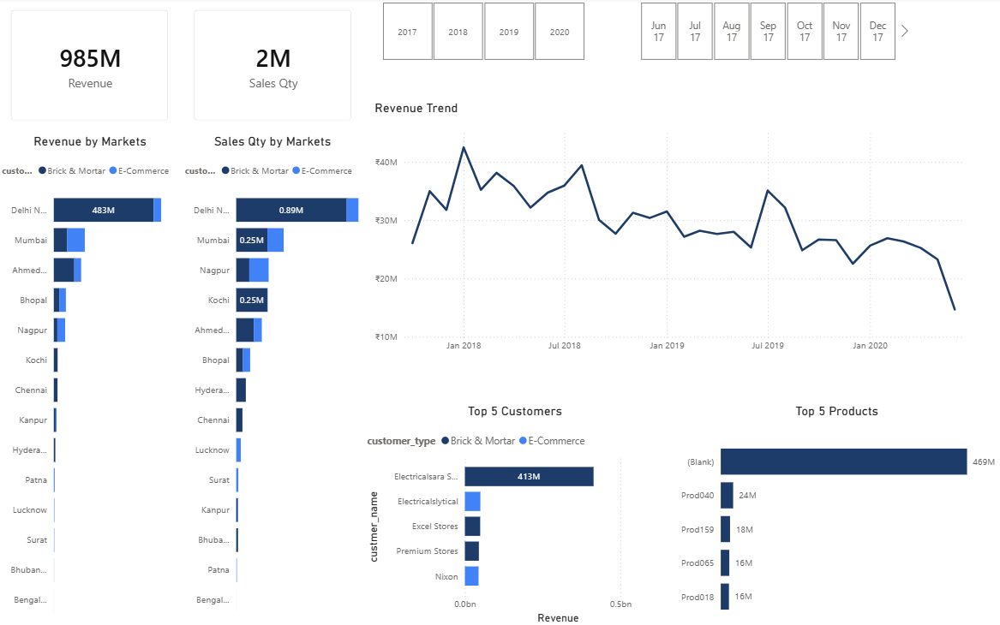
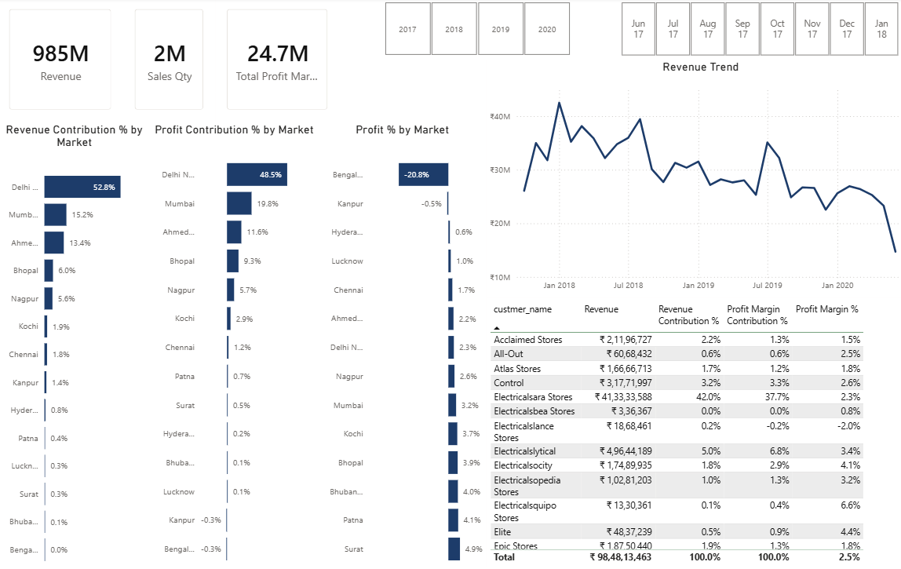
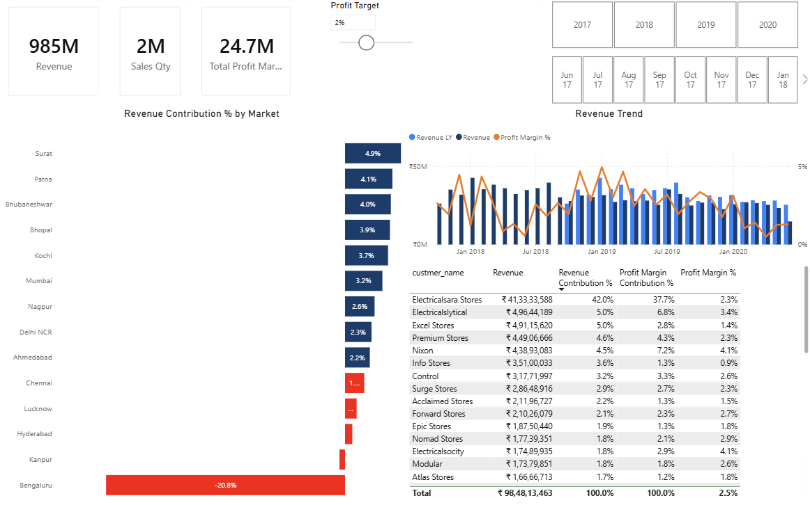

# Sales Insights Dashboard

## Overview

This project is an interactive sales dashboard built using Power BI and MySQL. It analyzes sales performance across different markets, customers, and products to provide business insights through interactive visualizations.

The project demonstrates an end-to-end Business Intelligence workflow, including data storage in MySQL, data transformation using Power Query, data modeling, DAX calculations, and dashboard development in Power BI.

## Technologies Used

- Power BI
- SQL (MySQL)
- Power Query
- DAX

## Project Highlights

- Connected Power BI to a MySQL database.
- Performed data cleaning and transformation using Power Query.
- Created DAX measures for business analysis.
- Built an interactive dashboard with filters and KPI visualizations.

## 📊 Dashboard Preview

### Key Insights

### Profit Analysis

### Performance Insights

## 📂 Project Files

- `sales-insights-dashboard.pbix` – Power BI dashboard file
- `sales-insights-database.sql` – MySQL database dump
